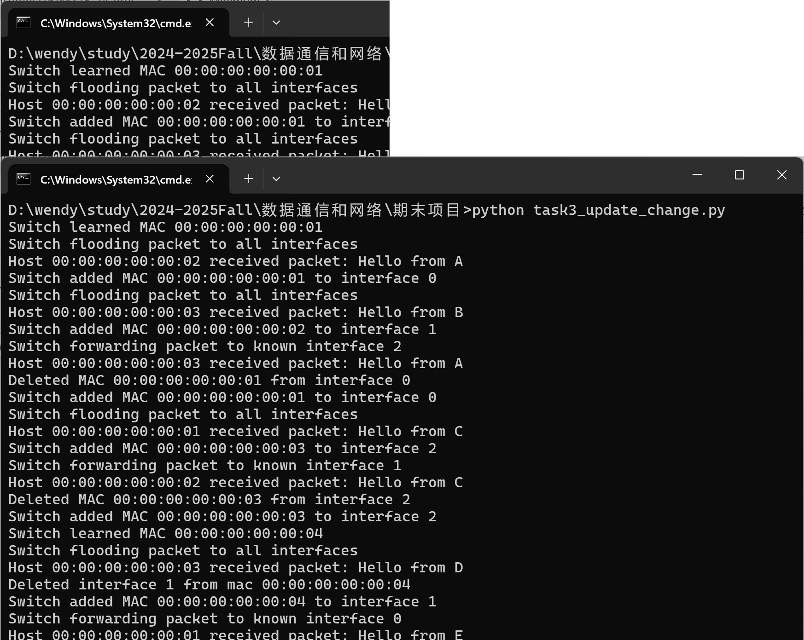

# Minimum Sim LAN
This project simulates a simple local area network communication using Python. The project introduction is [here](https://github.com/ensomnia16/EE315-24-Proj).

## task1: bus implementation

## task2: star implementation

## task3: more complex Sim-LAN
### Switch table update when interface/MAC changes
When new source/destination is from an old mac with new interface/old interface with new mac, it will be update.

Key changes in [add_mac(self, mac, interface)](https://github.com/Wendy-Ying/Minimum-Sim-LAN/blob/main/task3_update_change.py#L66).

