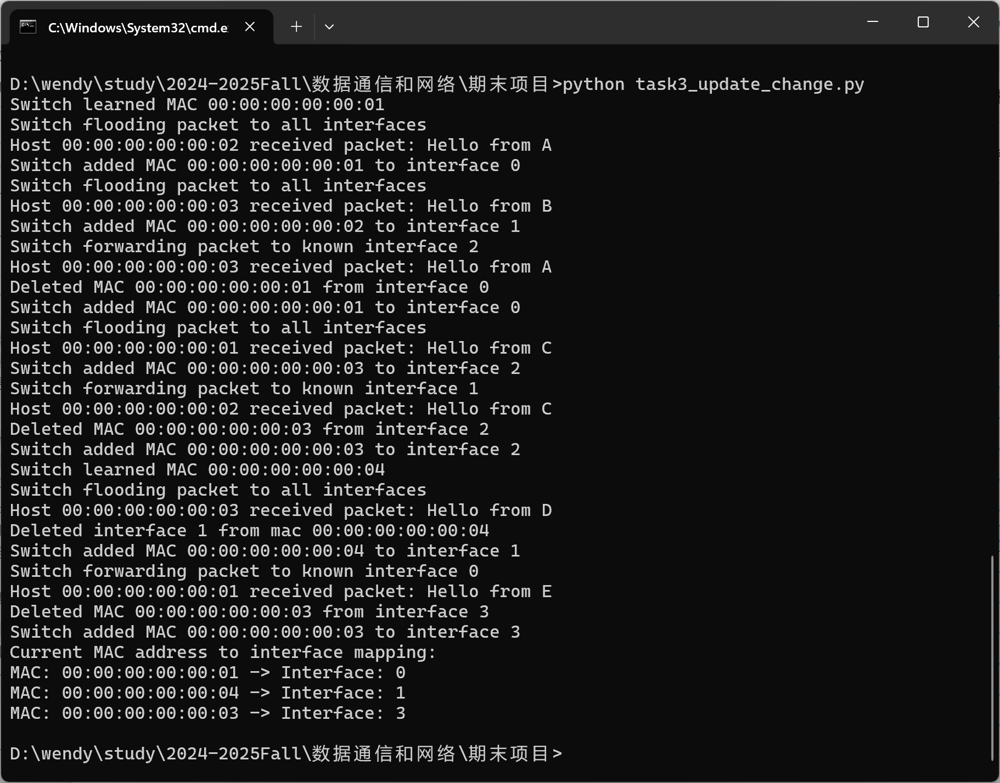
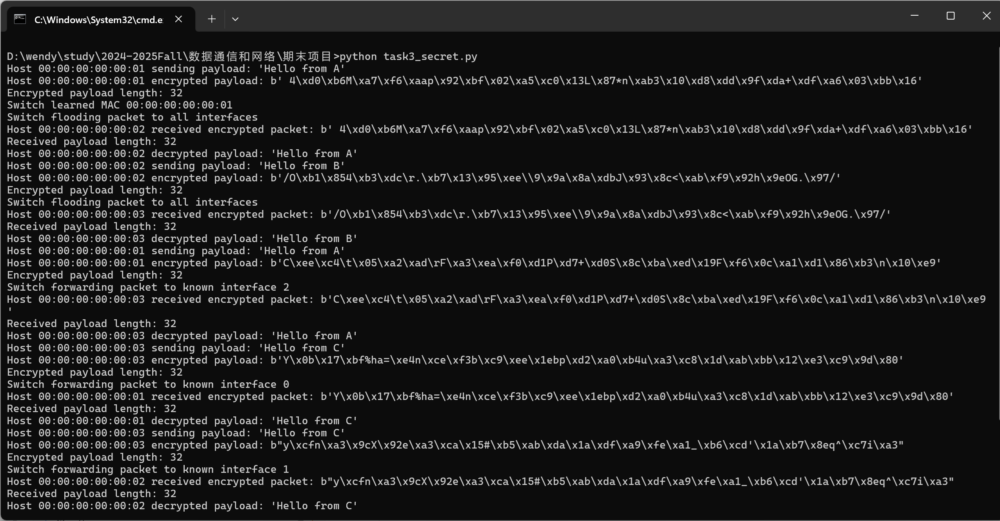
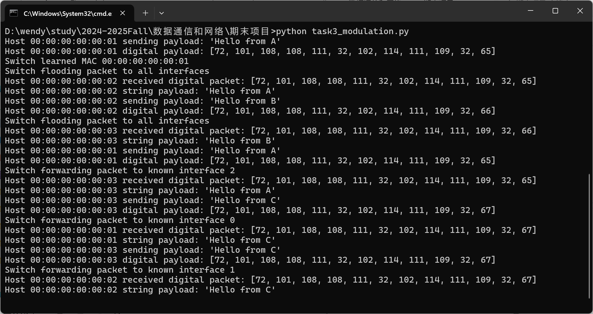
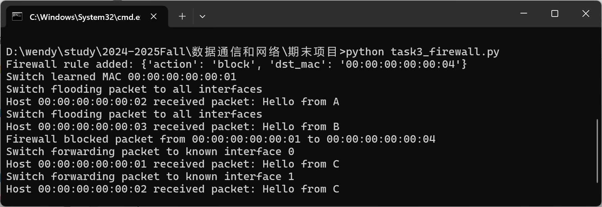
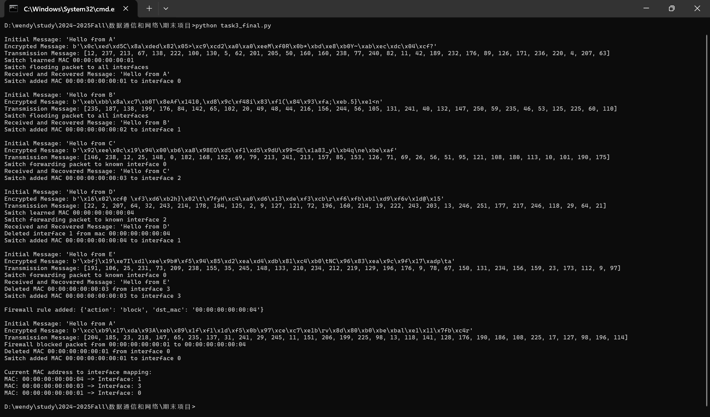

# Minimum Sim LAN
This project simulates a simple local area network communication using Python. The project introduction is [here](https://github.com/ensomnia16/EE315-24-Proj). The report is [here](https://github.com/Wendy-Ying/Minimum-Sim-LAN/blob/main/report.pdf).

## cool!

## task1: bus implementation
implemention [here](https://github.com/Wendy-Ying/Minimum-Sim-LAN/blob/main/skeleton_bus.py), test [here](https://github.com/Wendy-Ying/Minimum-Sim-LAN/blob/main/test_bus.py)

## task2: star implementation
implemention [here](https://github.com/Wendy-Ying/Minimum-Sim-LAN/blob/main/skeleton_switch.py), test [here](https://github.com/Wendy-Ying/Minimum-Sim-LAN/blob/main/test_switch.py)

## task3: more complex Sim-LAN
### Switch table update when interface/MAC changes
When new source/destination is from an old mac with new interface/old interface with new mac, it will be update.

Key changes in [add_mac(self, mac, interface)](https://github.com/Wendy-Ying/Minimum-Sim-LAN/blob/main/task3_update_change.py#L66).

### Encrypted Packets
The packages are encrypted and decrypted.

Key changes in [send_packet(self, dst_mac, payload, switch), receive_packet(self, packet)](https://github.com/Wendy-Ying/Minimum-Sim-LAN/blob/main/task3_secret.py).

### Modulation
Using python to do modulation, we can transfer the string to digits and transmitt them. Write modulation module and demoulation module.

Key changes in [string2digital(message), digital2string(message)](https://github.com/Wendy-Ying/Minimum-Sim-LAN/blob/main/task3_modulation.py#L4)

### Firewall
Firewall is very important for the true network. The program allows adding firewall rule and block them.

Key changes in [check_firewall(self, packet)](https://github.com/Wendy-Ying/Minimum-Sim-LAN/blob/main/task3_firewall.py#L72)

## Final Result
All works are integrated into [here](https://github.com/Wendy-Ying/Minimum-Sim-LAN/blob/main/task3_final.py).

